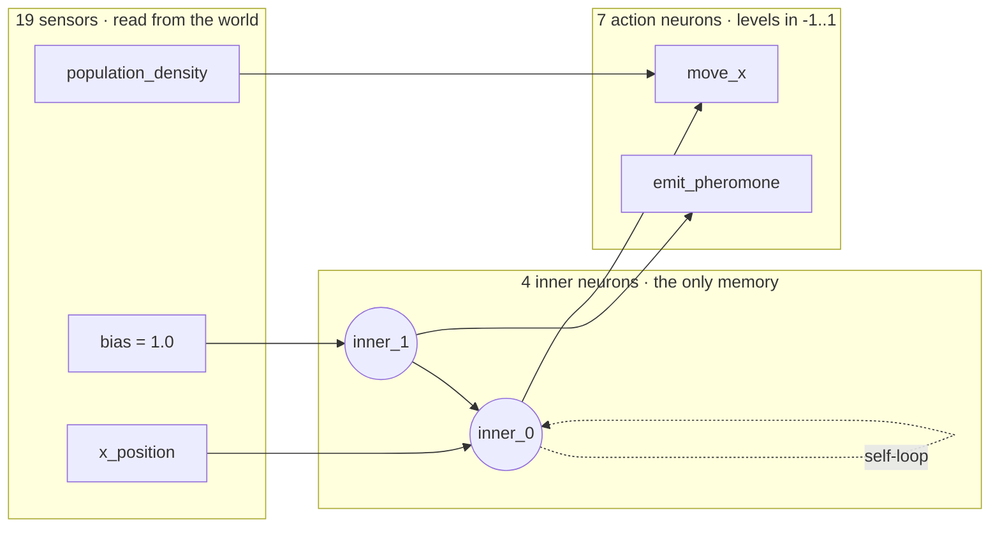
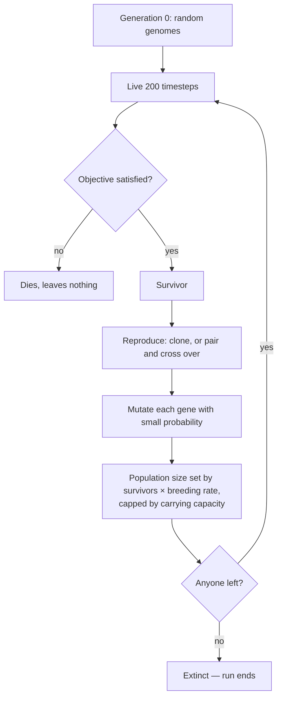

# How the brain works

A guide to what is actually happening inside a creature, and to what evolution
is doing to those creatures across generations.

Nothing here is trained. There is no backpropagation, no gradient, no reward
signal, and no learning within a creature's lifetime. A brain is fixed at birth
and never changes. The only thing that improves is the *population*, and the
only mechanism is that some creatures reproduce and others do not.

---

## 1. What kind of system this is

In the usual taxonomy this is **neuroevolution with a direct encoding**:

| property | this simulation | a typical trained network |
| --- | --- | --- |
| where weights come from | inherited, mutated | gradient descent on a loss |
| feedback signal | survived / did not | a differentiable error, per example |
| credit assignment | none — the whole genome passes or fails | per-weight, via the chain rule |
| changes during a lifetime | activations only, never weights | weights change every batch |
| what improves | the population's gene pool | one network's parameters |

"Direct encoding" means every gene *is* one connection, with no developmental
step in between. The genome is not a recipe for growing a brain; it is a
literal wiring list. That makes brains easy to read back, which is why
`--draw-brain` and the text dump are useful rather than decorative.

The closest well-known relative is the fixed-length direct-encoded end of
neuroevolution — simpler than NEAT, which grows genomes over time and protects
new structures with speciation. Here the genome length never changes, so
evolution rearranges a fixed budget of connections rather than accumulating
new ones.

---

## 2. The genome

A genome is a fixed-length tuple of genes. Each gene describes exactly one
connection:

```
source ──weight──> sink
```

| field | possible values |
| --- | --- |
| `source_kind` | a sensor, or an inner neuron |
| `source_id` | which sensor (19 of them) or which inner neuron (4) |
| `sink_kind` | an inner neuron, or an action |
| `sink_id` | which inner neuron (4) or which action (7) |
| `weight` | a float in `[-4, +4]` |

Genes are immutable. An offspring's genome shares gene objects with its
parent's, which is what makes it structurally impossible for a child to
disturb the parent it came from.

### The size of the search space

With the defaults — 19 sensors, 4 inner neurons, 7 actions — there are:

- **23 possible sources** (19 sensors + 4 inner neurons)
- **11 possible sinks** (4 inner neurons + 7 actions)
- **253 distinct connections** that any single gene could encode

A genome holds **24 genes**, each independently choosing one of those 253
endpoint pairs *and* a continuous weight. Duplicates are allowed and simply
sum, so two genes on the same connection act as one stronger connection.

The point is not the exact number. It is that the space is far too large to
search by enumeration, has no gradient to follow, and is explored only by
mutation and selection.

---

## 3. The network

Signals flow left to right, with one exception that matters enormously.



Four kinds of connection are possible, and they are not equivalent:

| connection | what it gives a creature |
| --- | --- |
| sensor → action | a reflex: perceive, act, done |
| sensor → inner | perception fed into internal state |
| inner → action | behaviour driven by internal state rather than the world |
| **inner → inner** | **memory, timing, oscillation** — including self-loops |

There is no separate bias term on any neuron. Instead there is a `bias`
*sensor* that always reads `1.0`, so a connection from it acts as a constant
drive. Evolution gets a bias only if it wires one, and it pays upkeep for it
like any other sense.

There are no layers in the usual sense. A genome may wire nothing to the inner
neurons at all, producing a pure stimulus-response creature; or wire almost
everything through them; or wire a loop that ignores the world entirely.

---

## 4. What happens in one timestep

Every living creature runs this once per step, in a shuffled order so that no
creature gets a permanent advantage in claiming contested cells.

**Step 1 — read the senses it actually uses.** Only sensors that appear as a
source somewhere in the genome are evaluated. Most genomes ignore most senses,
and this is both the main performance optimisation and the basis of the
metabolic cost.

**Step 2 — update the inner neurons.**

$$\text{inner}_j \leftarrow \tanh\left(\sum_i w_{ij}\,s_i \;+\; \sum_k w_{kj}\,\text{inner}_k^{\text{prev}}\right)$$

Note the superscript. Inner neurons read the **previous** timestep's inner
values, not the current ones. That one-step delay is what makes recurrence
work: a self-loop `inner_0 → inner_0` becomes a value that persists and decays
across time, and a two-neuron loop can oscillate.

**Step 3 — compute the action levels.**

$$\text{action}_m = \tanh\left(\sum_i w_{im}\,s_i \;+\; \sum_j w_{jm}\,\text{inner}_j^{\text{current}}\right)$$

Actions read the **freshly updated** inner values. So a `sensor → inner →
action` path completes within a single timestep — it is not delayed. Only
inner-to-inner links carry a delay.

`tanh` squashes everything into `[-1, 1]`, which keeps action levels bounded
and gives connections a saturating rather than runaway effect.

Working memory is cleared at the start of every generation. Nothing a creature
learns — in the weak sense of accumulating internal state — survives its own
death.

---

## 5. From action levels to an actual move

The action neurons do not take turns. They all fire at once and **compete**,
summing into an urge along each axis.

```
urge_x  =  move_x
        +  move_forward × last_dx
        +  move_left    × (−last_dy)      ← a quarter turn from the heading
        +  move_random  × (random dx)

urge_y  =  move_y
        +  move_forward × last_dy
        +  move_left    × (last_dx)
        +  move_random  × (random dy)
```

Then `stay` damps whatever the others wanted, but only when it is positive:

```
urge *= 1 − max(0, stay)
```

Finally each axis is resolved **probabilistically**: the urge is clamped to
`[-1, 1]` and its magnitude is read as a probability of moving that way.

| urge | result |
| --- | --- |
| `+0.3` | steps east about 30% of the time, otherwise stays put |
| `−0.9` | steps west about 90% of the time |
| `0.0` | never moves on that axis |

This is a deliberate design choice with real consequences. Behaviour is
stochastic rather than deterministic, so a mediocre strategy still gets some
lucky survivors, and evolution has a smoother gradient to climb than an
all-or-nothing threshold would give it.

The two axes are drawn independently, so diagonal movement falls out for free.
A blocked diagonal then falls back to whichever single axis is still open,
which is why creatures slide along walls instead of sticking to them.

---

## 6. How the senses fit in

There are 19 senses, all normalised into `[-1, 1]` so that no single input can
dominate the weighted sums simply by having a bigger natural range.

| group | senses | what they make possible |
| --- | --- | --- |
| **Sensing** (13) | `x_position`, `y_position`, `border_distance`, `population_density`, `neighbours_east`, `neighbours_north`, `nearest_neighbour`, `blocked_forward`, `blocked_left`, `blocked_right`, `pheromone_here`, `pheromone_east`, `pheromone_north` | navigation, obstacle avoidance, following and fleeing, trail use |
| **Intelligence** (6) | `last_move_x`, `last_move_y`, `age`, `energy`, `random`, `bias` | persistence, timing, self-monitoring, noise, constant drive |

Three of these deserve specific attention, because they are what make
non-trivial behaviour reachable at all:

**The directional pair.** `population_density` is a scalar — "it is crowded
here" — with no indication of *where*. `neighbours_east` and
`neighbours_north` are signed: `+1` means every neighbour in range lies that
way. Without a signed input, no weight can distinguish "toward" from "away",
so flocking and fleeing are unreachable in principle rather than merely
unlikely. With them, a single connection of either sign produces one or the
other.

**`age`.** Runs 0 → 1 across the generation. It is the only clean way to
behave differently early and late without needing a recurrent loop, which is
exactly what the two-phase objectives require.

**The pheromone senses.** The only channel through which one creature can
change what another perceives. Everything else a creature senses is either the
fixed world or the mere presence of others.

### Senses cost energy, which is the whole trade-off

Upkeep is charged per timestep as:

```
upkeep = metabolism + sense_cost × (number of DISTINCT senses the genome wires)
```

Two consequences worth understanding:

1. **Wiring the same sense twice is free.** The cost is on breadth of
   perception, not on genome size. A creature can afford many connections; it
   cannot afford many different *kinds* of input.

2. **Vestigial wiring still costs.** A sensor feeding an inner neuron that
   never reaches any action is functionally inert — but it is still counted,
   and still charged, every step of the creature's life. So there is genuine
   selective pressure to prune dead sensory connections, not merely to avoid
   adding them.

At the default cost, a brain wiring all 19 senses burns 0.86 energy per step,
about 172 over a 200-step generation, against a starting budget of 140. **The
maximal creature starves.** More capability is not better; it has to earn its
keep.

---

## 7. What happens across the generations



### Selection

Binary and unforgiving. An objective either passes a creature or it does not —
there is no partial credit, no ranking, no "nearly made it". Everything about
a genome succeeds or fails together, which is why there is no credit
assignment: nothing identifies *which* connection was responsible.

### Reproduction

**Asexual** clones a survivor. All new variation comes from mutation, and any
survivor breeds regardless of where it ended up.

**Sexual** requires two survivors within `mating_radius` of each other. They
pair greedily and monogamously, and their genomes undergo **uniform
crossover** — every connection independently taken from one parent or the
other. Uniform rather than single-point because genes here are independent
connections rather than a linked sequence; there is no linkage for a crossover
point to preserve.

A survivor with nobody in range leaves nothing. Reaching the zone stops being
enough if you arrive alone.

### Mutation

Each gene independently has a small chance of being altered. When one is hit,
exactly one of its five fields changes:

| field changed | effect |
| --- | --- |
| `weight` | retunes an existing connection — a small step |
| `source_id` / `sink_id` | rewires one end to a different sensor, neuron or action |
| `source_kind` / `sink_kind` | switches the endpoint's *type*, and redraws the id to match |

The last two are why topology evolves and not just strength. A single mutation
can hand control of an action to a different part of the brain, or connect a
creature to a sense its entire ancestry ignored.

### Population dynamics

The population is earned, not refilled. Breeding survivors leave offspring at
a **density-dependent** rate: a full population must survive at 25% just to
hold its ground, while one that has crashed needs only 6.25% to start climbing
back. Below that band it slides toward zero, and zero is final.

---

## 8. What you actually observe

These are measured from real runs, not illustrations.

**Survival climbs, fast.** Against the `left` objective, survival goes from
around 22% for random genomes to over 90% within a handful of generations. The
whole population is descended from the few that got lucky.

**Senses get pruned.** With the metabolic cost active, mean distinct senses
wired falls from about 8.9 to 6.9 over thirty generations. Without the cost it
stays flat. Evolution is actively discarding perception it is not using.

**Specific senses die or take over.** In one 16-generation run:

```
x_position         45%  →   3%      abandoned
population_density 33%  →  67%      adopted
```

That is a population switching from navigating by absolute position to
navigating by its neighbours. The gene-expression view in the UI shows this
live; sweeping across a bar draws that sense's whole history.

**Lineages collapse.** Runs routinely end with 2–3% of founding lines still
present — 200 founders reduced to 2 or 3. Most of the original variation is
gone, and further novelty has to come from mutation.

**Brains stay legible.** Because the encoding is direct, an evolved solution
can simply be read:

```
border_distance --(-2.13)--> move_x
inner_2 --(+1.44)--> move_forward
```

---

## 9. What this system is not

Being clear about the limits is part of understanding the mechanism.

- **No learning within a lifetime.** Weights never change after birth. A
  creature that would benefit from adapting cannot.
- **No complexification.** Genome length is fixed for a whole run. Brains
  cannot grow or shrink; evolution only rearranges a fixed budget. There is no
  gene duplication or deletion.
- **No speciation.** Any two survivors can breed, so a promising new structure
  is immediately diluted by crossover with the incumbent majority. This is the
  problem NEAT solves and this simulation does not.
- **No credit assignment.** Selection sees only the whole creature. A brilliant
  connection in an otherwise poor genome dies with it.
- **Selection is binary.** Objectives that almost nobody can satisfy early on
  give evolution no gradient at all, which is why every objective is tuned so
  an unevolved population clears the replacement threshold.

Each of these is a deliberate simplification rather than an oversight, and each
is a reasonable place to extend the simulation.

---

## Where this lives in the code

| file | what it holds |
| --- | --- |
| `brain_utils.py` | genes, mutation, and `Brain.think` — the network itself |
| `capability_utils.py` | the `Sensor` and `Action` enums, and every sensing function |
| `organism.py` | `Organism.act`, which turns action levels into a move |
| `reproduction.py` | asexual and sexual strategies, and the breeding rate |
| `objectives.py` | what it takes to earn the right to reproduce |
| `population_stats.py` | gene expression and lineage tracking across the population |
